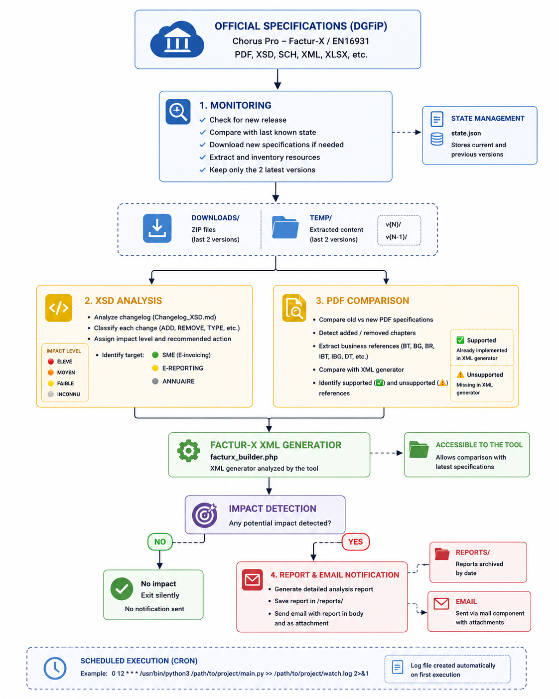

<p align="center">
  
</p>


[](https://www.linkedin.com/in/palks-studio/)

<p align="center">
  <a href="https://palks-studio.com">
    
  </a>
</p>

# Factur-X Watcher

> Ce dépôt constitue une présentation technique et une documentation du projet.  
> Il ne contient pas de code source téléchargeable ni de fichiers de production.

---

## 🇫🇷 Version française

Surveillance automatique des spécifications B2B DGFiP (Factur-X / Chorus Pro).  
Lancé quotidiennement en cron, il détecte les nouvelles versions, analyse les changements et alerte par mail si le moteur Factur-X doit être mis à jour.

---

## Structure

```
facturx-watcher/
│
├── monitor.py            → Script principal (cron entry point)
├── xsd_analyzer.py       → Analyse du Changelog_XSD.md (impacts 🔴🟠🟡)
├── pdf_analyzer.py       → Comparaison des PDF Chorus Pro (références BT/BG/BR…)
├── notifier.php          → Envoi du mail d'alerte + sauvegarde rapport
├── state.json            → État courant et précédent (versions téléchargées)
├── facturx_builder.php   → Générateur XML Factur-X utilisé pour l'analyse
├── mail.php              → Fonction d'envoi des emails avec pièces jointes
│
├── downloads/            → ZIPs téléchargés (2 derniers conservés)
├── temp/                 → ZIPs extraits (2 dernières versions conservées)
│   ├── v{N}/
│   └── v{N-1}/
│
└── reports/              → Rapports .txt sauvegardés par notifier.php
```

---

## Fonctionnement

### 1. Surveillance des spécifications

- Vérifie régulièrement la source officielle afin de détecter la publication d'une nouvelle version des spécifications  
- Compare la dernière version disponible avec le dernier état enregistré  
- Télécharge et extrait automatiquement les nouvelles spécifications lorsqu'une mise à jour est détectée  
- Dresse l'inventaire des ressources extraites (PDF, XSD, SCH, XML, XLSX, etc.)  
- Lance les différentes étapes d'analyse afin d'identifier les éventuels impacts  
- Conserve uniquement les deux dernières versions téléchargées et extraites

Structure du fichier d'état :

```json
{
    "current": {
        "version": "",
        "date": "",
        "zip": "",
        "file": "",
        "temp": ""
    },
    "previous": {
        "version": "",
        "date": "",
        "zip": "",
        "file": "",
        "temp": ""
    }
}
```

### 2. Analyse des modifications XSD

- Analyse le journal des modifications fourni avec les spécifications  
- Classe automatiquement chaque modification selon sa nature : ajout, suppression, cardinalité, type, activation ou commentaire  
- Attribue un niveau d'impact et une action recommandée :

| Type        |Impact       | Action                                                 |
|-------------|-------------|--------------------------------------------------------|
| CARDINALITE | 🔴 ÉLEVÉ   | Vérifier les champs obligatoires et les validations XML |
| TYPE        | 🔴 ÉLEVÉ   | Mettre à jour le type de donnée attendu                 |
| SUPPRESSION | 🔴 ÉLEVÉ   | Retirer ce champ s'il est encore généré                 |
| AJOUT       | 🟠 MOYEN   | Vérifier si ce nouveau champ doit être généré           |
| ACTIVATION  | 🟡 FAIBLE  | Contrôler si ce champ doit désormais être renseigné     |
| COMMENTAIRE | 🟡 FAIBLE  | Vérifier si ce champ n'est plus utilisé                 |
| AUTRE       | ⚪ INCONNU | Analyse manuelle                                        |

- Distingue les cibles : 🟢 SME (E-invoicing), 🟡 E-REPORTING, ⚪ ANNUAIRE

### 3. Comparaison des spécifications PDF

- Compare l'ancienne et la nouvelle version des spécifications PDF  
- Détecte les chapitres ajoutés ou supprimés entre les deux versions  
- Extrait les références métier (BT, BG, BR, IBT, IBG, DT, etc.) pour chaque chapitre  
- Compare ces références avec celles déjà prises en charge par le générateur XML afin d'identifier les éléments implémentés (✅) et ceux qui restent à intégrer (⚠️)  
- Déclenche une notification lorsqu'un impact potentiel est détecté

Pour chaque référence métier détectée :

| Résultat                          |                                                                             Signification |
|-----------------------------------|-------------------------------------------------------------------------------------------|
| ✅ Référence prise en charge     | La référence est déjà implémentée dans le générateur XML, aucune action requise.           |
| ⚠️ Référence non prise en charge | La référence est absente du générateur XML et nécessite une analyse ou une implémentation. |

Le générateur XML analysé doit être accessible par l'outil afin de permettre la comparaison avec les nouvelles spécifications.

### 4. Notification par email

- Génère un rapport détaillé de l'analyse réalisée  
- Archive automatiquement le rapport dans le dossier des rapports  
- Envoie une notification par email contenant le rapport dans le corps du message ainsi qu'en pièce jointe  
- Repose sur un composant de messagerie compatible avec l'envoi de pièces jointes

---

## Exécution planifiée

Le programme est conçu pour être exécuté automatiquement de manière régulière (par exemple via **cron**).

Exemple d'exécution quotidienne à **12:00** :

```cron
0 12 * * * /usr/bin/python3 /chemin/vers/le/projet/main.py >> /chemin/vers/le/projet/watch.log 2>&1
```

Le fichier de journal est créé automatiquement lors de la première exécution.

---

## Notifications

Une notification est envoyée uniquement lorsqu'un impact potentiel est détecté, par exemple :

- Une nouvelle référence métier n'est pas prise en charge par le générateur XML  
- Une référence métier existante a été supprimée des spécifications

Si aucune modification susceptible d'affecter le générateur n'est détectée, le programme se termine silencieusement sans envoyer de notification.

---

## 🇬🇧 English Version

> This repository is a technical presentation and documentation repository.  
> It does not contain downloadable source code or production files.

Automatically monitors the DGFiP B2B specifications (Factur-X / Chorus Pro).

Executed daily via cron, it detects new releases, analyzes specification changes, and sends an email alert whenever the Factur-X engine may require an update.

---

## Structure

```
facturx-watcher/
│
├── monitor.py            → Main script (cron entry point)
├── xsd_analyzer.py       → Analyzes Changelog_XSD.md (🔴🟠🟡 impact levels)
├── pdf_analyzer.py       → Compares Chorus Pro PDF specifications (BT/BG/BR references…)
├── notifier.php          → Sends email notifications and saves reports
├── state.json            → Current and previous state (downloaded versions)
├── facturx_builder.php   → Current Factur-X XML generator
├── mail.php              → Email helper with attachment support
│
├── downloads/            → Downloaded ZIP archives (last 2 versions retained)
├── temp/                 → Extracted ZIP archives (last 2 versions retained)
│   ├── v{N}/
│   └── v{N-1}/
│
└── reports/              → Text reports saved by notifier.php
```

`mailer.php` is located in the parent directory (`../mailer.php`).

---

### 1. Specification Monitoring

- Regularly checks the official source for newly published specification releases  
- Compares the latest available version with the previously recorded state  
- Automatically downloads and extracts new specifications when an update is detected  
- Generates an inventory of the extracted resources (PDF, XSD, SCH, XML, XLSX, etc.)  
- Runs the analysis workflow to identify potential impacts  
- Retains only the two most recent downloaded and extracted versions

State file structure:

```json
{
    "current": {
        "version": "",
        "date": "",
        "zip": "",
        "file": "",
        "temp": ""
    },
    "previous": {
        "version": "",
        "date": "",
        "zip": "",
        "file": "",
        "temp": ""
    }
}
```

---

### 2. XSD Change Analysis

- Analyzes the changelog provided with the specifications  
- Automatically classifies each change by type: addition, removal, cardinality, data type, activation, or comment  
- Assigns an impact level and a recommended action:

| Type        | Impact      | Recommended Action                               |
|-------------|-------------|--------------------------------------------------|
| CARDINALITY | 🔴 HIGH    | Verify mandatory fields and XML validation rules  |
| TYPE        | 🔴 HIGH    | Update the expected data type                     |
| REMOVAL     | 🔴 HIGH    | Remove the field if it is still being generated   |
| ADDITION    | 🟠 MEDIUM  | Check whether the new field should be generated   |
| ACTIVATION  | 🟡 LOW     | Verify whether the field is now required          |
| COMMENT     | 🟡 LOW     | Check whether the field is no longer used         |
| OTHER       | ⚪ UNKNOWN | Manual review required                            |

- Distinguishes the affected targets: 🟢 SME (E-invoicing), 🟡 E-Reporting, ⚪ Directory

---

### 3. PDF Specification Comparison

- Compares the previous and current versions of the PDF specifications  
- Detects sections that have been added or removed between the two versions  
- Extracts business references (BT, BG, BR, IBT, IBG, DT, etc.) from each section  
- Compares these references with those already supported by the XML generator to identify implemented items (✅) and missing ones (⚠️)  
- Triggers a notification when a potential impact is detected

For each detected business reference:

| Result                    | Meaning                                                                                     |
|---------------------------|---------------------------------------------------------------------------------------------|
| ✅ Supported reference   | The reference is already implemented in the XML generator. No action is required.            |
| ⚠️ Unsupported reference | The reference is not implemented in the XML generator and requires review or implementation. |

The XML generator being analyzed must be accessible to the tool so it can be compared against the latest specifications.

### 4. Email Notification

- Generates a detailed analysis report  
- Automatically archives the report in the reports directory  
- Sends an email notification containing the report both in the message body and as an attachment  
- Relies on an email component that supports file attachments

---

## Scheduled Execution

The application is designed to run automatically on a regular basis (for example, using **cron**).

Example of a daily execution at **12:00 PM**:

```cron
0 12 * * * /usr/bin/python3 /path/to/project/main.py >> /path/to/project/watch.log 2>&1
```

The log file is created automatically during the first execution.

---

## Notifications

A notification is sent only when a potential impact is detected, for example:

- A newly introduced business reference is not supported by the XML generator  
- An existing business reference has been removed from the specifications

If no changes likely to affect the XML generator are detected, the application exits silently without sending any notification.

---

© Palks Studio — see LICENSE.md  
- https://palks-studio.com
